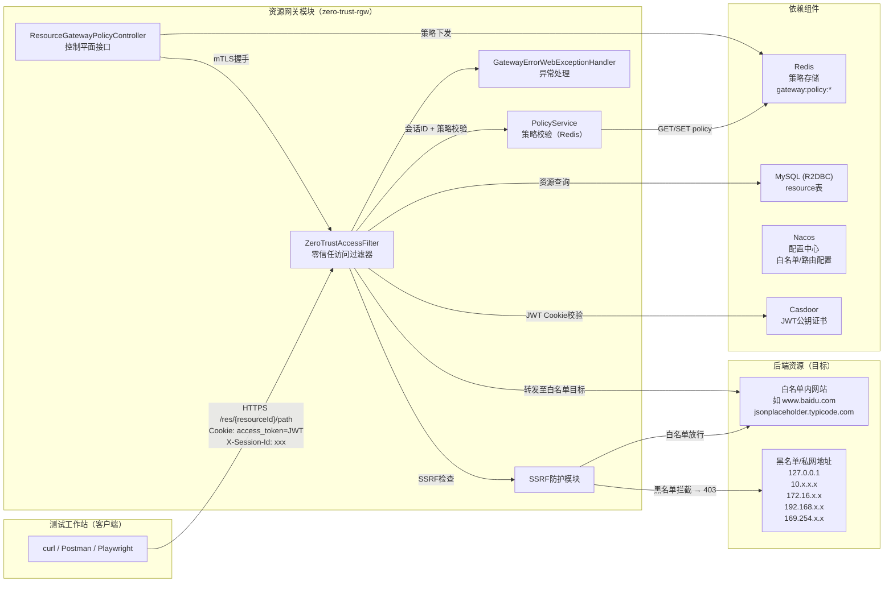

# C模块测试大纲
## 资源网关模块

---

**文档编号**：CESI-20250504004-104.CSDG.___C__  
**版本**：1.0  
**编制单位**：中国电子技术标准化研究院赛西实验室  
**编制日期**：2025年5月  
**审核人**：  
**批准人**：

---

## 版本记录

| 版本号 | 编制/修订日期 | 编制/修订人 | 描述 |
|--------|--------------|-------------|------|
| 1.0 | 2025-05-18 | 资源网关研制团队 | 新建 |

---

## 文档信息

| 项目 | 内容 |
|------|------|
| 文档名称 | C模块测试大纲 — 资源网关模块 |
| 所属模块 | C模块（资源网关模块） |
| 编制单位 | 中国电子技术标准化研究院赛西实验室 |
| 编制人 | |
| 编写日期 | 2025-05-18 |
| 审核人 | |
| 审核日期 | |
| 批准人 | |
| 批准日期 | |

---

## 目 录

1. [概述](#1-概述)
   - 1.1. 任务来源
   - 1.2. 编制依据和原则
   - 1.2.1. 编制依据
   - 1.2.2. 编制原则
   - 1.2.3. 测试目的
2. [被测样品要求](#2-被测样品要求)
   - 2.1. 被测样品要求
3. [测试策略](#3-测试策略)
   - 3.1. 测试原则
   - 3.2. 任务分工
   - 3.3. 测试计划安排、时间和地点
4. [测试环境](#4-测试环境)
   - 4.1. 硬件环境
   - 4.2. 软件环境
   - 4.3. 测试设备
   - 4.4. 测试拓扑图
5. [测试内容及方法](#5-测试内容及方法)
   - 5.1. JWT认证与令牌校验功能测试
   - 5.2. 会话ID校验功能测试
   - 5.3. 资源ID匹配校验功能测试
   - 5.4. Redis策略校验功能测试
   - 5.5. SSRF防护功能测试
   - 5.6. 透明代理转发功能测试
   - 5.7. 控制平面策略下发接口测试
   - 5.8. mTLS双向认证配置测试
   - 5.9. 异常处理与容错能力测试
   - 5.10. 路由与过滤器链测试
6. [测试终止条件](#6-测试终止条件)
   - 6.1. 评价准则和方法
   - 6.2. 测试终止条件
7. [需求可追溯性](#7-需求可追溯性)

---

## 1. 概述

### 1.1. 任务来源

本文档依据工信部《2023年服务器BMC管理模块项目合同书》中C模块（资源网关模块）的测试要求，规范资源网关模块的测试目的、测试依据、被测样品要求、测试策略、测试仪器仪表和测试工具的要求、测试内容及方法，以及测试进度及人员安排，测试判定准则。

本文档是资源网关模块第三方测试指导性文件，指导测试工具选择、验证，测试用例和脚本开发，测试用例的拟制，规范资源网关模块的测试。

### 1.2. 编制依据和原则

#### 1.2.1. 编制依据

| 序号 | 名称 | 发布日期 | 编写单位 |
|------|------|---------|---------|
| 1 | 《2023年服务器BMC管理模块项目合同书》 | 2023 | 工业和信息化部 |
| 2 | GB/T 25000.51-2016《系统与软件工程 系统与软件质量要求和评价（SQuaRE）第51部分：就绪可用软件产品（RUSP）的质量要求和测试细则》 | 2016 | 国家标准化管理委员会 |
| 3 | 服务器基板管理控制器（BMC）技术要求（报批稿） | 2025 | 工业和信息化部 |
| 4 | 零信任资源网关软件需求规格说明书 | 2025 | 研制单位 |
| 5 | 零信任资源网关系统设计方案 | 2025 | 研制单位 |

#### 1.2.2. 编制原则

测试方法优先选择国家标准、国家军用标准、行业标准中确定的测试方法；对于无标准依据的，采用业内通行做法或已通过测试验证的方法；优先选择量化考核方式，非量化测试项最大化进行量化转换；优选自动化测试方式（通过测试工具、测试脚本、测试用例、测试仪器）获取测试结果，确因技术条件限制不能自动化测试的，则采用人工测试。

#### 1.2.3. 测试目的

本次测试的目的是测试验证本项目研制的资源网关模块是否达到《2023年服务器BMC管理模块项目合同书》中C模块的建设内容和技术指标要求，测试结果可用于项目验收。

资源网关模块的核心功能包括：

- **JWT认证与令牌校验**：通过Casdoor公钥（RS256算法）验证JWT令牌的合法性，包括签名验证、过期检查、字段完整性检查，JWT通过Cookie（`access_token`）方式传递。
- **会话ID校验**：通过请求头`X-Session-Id`验证用户会话的唯一性与合法性。
- **资源ID匹配**：验证JWT中声明的`resourceId`与请求路径中提取的`resourceId`是否一致，防止越权访问。
- **Redis策略校验**：从Redis中查询并验证访问策略，策略有效期30分钟，校验策略的`allowed`标志、用户ID、资源ID、过期时间。
- **SSRF防护**：对目标URL进行多重安全校验，拦截回环地址（127.0.0.0/8）、链路本地地址（169.254.0.0/16，云元数据地址段）、RFC1918私网地址（10.0.0.0/8、172.16.0.0/12、192.168.0.0/16），仅放行白名单中的目标主机。
- **透明代理转发**：将已验证通过的请求透明转发至后端资源服务器，支持路径拼接、查询参数透传。
- **控制平面接口**：接收控制平面下发的策略并存储至Redis，提供健康检查接口。
- **mTLS双向认证**：网关对外使用SSL证书，对向上游通信支持mTLS双向认证。
- **异常处理**：对Redis连接失败、R2DBC连接失败、后端不可达等异常情况进行统一处理和错误响应。

---

## 2. 被测样品要求

### 2.1. 被测样品要求

本次测试，被测单位提供的样品要求见表2-1。

**表 2-1 测试样品要求**

| 样品名称 | 要求 | 备注 |
|---------|------|------|
| 资源网关模块 | 包含资源网关微服务（zero-trust-rgw）、MySQL数据库（zerotrust_rgw）、Redis缓存、Alibaba Nacos服务注册与配置中心、mTLS证书 | 微服务框架：Spring Cloud Gateway（响应式）；数据库：R2DBC + MySQL；缓存：Reactive Redis；JWT验签依赖Casdoor公钥证书 |

---

## 3. 测试策略

### 3.1. 测试原则

**测试指标覆盖**：覆盖《国产服务器BMC合同》中C模块资源网关模块全部技术指标要求，包括JWT认证与会话管理、零信任访问控制策略校验、SSRF安全防护、透明代理转发、控制平面策略同步、mTLS双向认证、异常处理与容错等。

**测试执行原则**：本次测试执行一轮测试记录测试问题，待问题修改后，回归测试。

**方法确定原则**：测试方法优先选择国家标准、国家军用标准、行业标准中确定的测试方法；对于无标准依据的，采用业内通行做法或已通过测试验证的方法；优先选择量化考核方式，非量化测试项最大化进行量化转换；优选自动化测试方式（通过测试工具、测试脚本、测试用例、测试仪器）获取测试结果，确因技术条件限制不能自动化测试的，则采用人工测试。

### 3.2. 任务分工

**表 3-1 任务分工表**

| 序号 | 参与方 | 工作内容 |
|------|--------|---------|
| 1 | 产品研制单位 | 1) 提供测试所需的软硬件设备及测试环境；2) 提供mTLS证书、Casdoor公钥证书等安全凭据；3) 配合产品测试单位完成产品测试 |
| 2 | 测试单位 | 按照本大纲的规定完成产品测试 |

**表 3-2 测试单位列表**

| 序号 | 单位名称 | 地址 | 联系方式 |
|------|---------|------|---------|
| 1 | 中国电子技术标准化研究院 | 北京市亦庄经济技术开发区同济南路8号 | |

### 3.3. 测试计划安排、时间和地点

**表 3-3 总体测试计划安排**

| 序号 | 测试任务 | 开始时间 | 结束时间 | 测试周期（天） | T1+5 | T1+7 | T1+9 | T1+19 | T1+22 | T1+25 |
|------|---------|---------|---------|---------------|------|------|------|-------|-------|-------|
| 1 | 测试需求分析 | T1 | T1+5 | 5 | ● | | | | | |
| 2 | 测试策划 | T1 | T1+5 | 5 | ● | | | | | |
| 3 | 测试设计与实现 | T1 | T1+7 | 7 | ● | ● | | | | |
| 4 | 接收样品 | T1+8 | T1+9 | 2 | | | ● | | | |
| 5 | 测试执行（含部署） | T1+10 | T1+19 | 10 | | | | ● | | |
| 6 | 测试总结 | T1+20 | T1+22 | 2 | | | | | ● | |
| 7 | 归档 | T1+23 | T1+25 | 2 | | | | | | ● |

本次测试含一轮回归测试。

**时间和地点**：本次测试时间和地点以双方约定时间和地点为准。

---

## 4. 测试环境

### 4.1. 硬件环境

**表 4-1 硬件测试环境**

| 序号 | 硬件名称 | 型号/规格 | 数量 | 用途 |
|------|---------|----------|------|------|
| 1 | 服务器 | 国产服务器（如飞腾/鲲鹏平台） | 1 | 承载资源网关微服务及依赖组件 |
| 2 | 测试工作站 | 通用x86_64架构PC | 1 | 运行自动化测试脚本（Playwright/curl/Postman） |
| 3 | 网络设备 | 千兆以太网交换机 | 1 | 测试网络连接 |

### 4.2. 软件环境

**表 4-2 软件测试环境**

| 序号 | 软件名称 | 版本 | 用途 |
|------|---------|------|------|
| 1 | Java运行环境（JRE/JDK） | OpenJDK 17+ | 运行Spring Cloud Gateway微服务 |
| 2 | Maven | 3.8+ | 编译构建zero-trust-rgw微服务 |
| 3 | MySQL | 8.0+ | R2DBC响应式数据库，存储resource表数据 |
| 4 | Redis | 6.0+ | 响应式Redis缓存，存储访问策略（gateway:policy:*） |
| 5 | Alibaba Nacos | 2.x | 服务注册与配置中心 |
| 6 | 资源网关微服务（zero-trust-rgw） | 1.0.0 | 被测系统 |
| 7 | Casdoor公钥证书 | PEM格式 | JWT令牌RS256验签 |
| 8 | mTLS证书 | PKCS12格式 | 网关SSL证书、双向认证truststore |
| 9 | Playwright | 最新稳定版 | E2E自动化测试 |
| 10 | curl / Postman | 最新稳定版 | HTTP接口手动/自动化测试 |
| 11 | 测试用JWT令牌生成工具 | — | 生成合法/非法/过期令牌 |
| 12 | Nacos配置中心数据集 | — | 注入SSRF白名单、网关路由等配置 |

### 4.3. 测试设备

**表 4-3 测试仪器设备**

| 序号 | 设备、仪器名称 | 数量 | 用途 |
|------|-------------|------|------|
| 1 | 测试工作站 | 1 | 运行测试脚本和工具 |
| 2 | Wireshark / tcpdump | 1 | 抓包分析SSRF防护、mTLS握手过程 |
| 3 | Redis CLI | 1 | 手动验证策略数据写入/读取 |

### 4.4. 测试拓扑图

测试拓扑如图4-1所示。



**图 4-1 资源网关模块测试拓扑图**

---

## 5. 测试内容及方法

### 5.1. JWT认证与令牌校验功能测试

#### 5.1.1. 测试内容

测试资源网关模块对JWT令牌的认证与校验功能。JWT令牌通过Cookie字段`access_token`传递，网关使用Casdoor公钥证书（RS256算法）验签。测试覆盖以下场景：缺少令牌、令牌签名无效、令牌已过期、令牌缺少必要字段（userId/resourceId）、合法令牌通过校验。

#### 5.1.2. 测试方法及步骤

1. **准备阶段**：
   - 部署zero-trust-rgw微服务至测试环境，确保Casdoor公钥证书路径正确配置（`jwt.certificate-path: /etc/gateway/certs/casdoor-cert.pem`）；
   - 在MySQL的`resource`表中预置测试用资源数据（如`resource_id=baidu-test`, `resource_url=https://www.baidu.com`）；
   - 在Redis中预置合法策略数据（`gateway:policy:{sessionId}`），TTL 30分钟，`allowed=true`，含正确`userId`和`resourceId`；
   - 生成测试用JWT令牌（使用与Casdoor相同的密钥签名）。

2. **TC-RGW-001：缺少access_token Cookie**：
   - 使用curl/Postman向`https://localhost:9527/res/baidu-test/`发送请求，**不携带**`Cookie: access_token=`头；
   - 记录HTTP响应状态码和`X-Error-Message`响应头内容。

3. **TC-RGW-002：空值access_token Cookie**：
   - 发送请求，携带`Cookie: access_token=`（空值）；
   - 记录HTTP响应状态码和`X-Error-Message`响应头内容。

4. **TC-RGW-003：JWT令牌签名无效**：
   - 生成一个使用**错误密钥**签名的JWT令牌，通过Cookie传递：`Cookie: access_token=<非法令牌>`；
   - 记录HTTP响应状态码和`X-Error-Message`响应头内容。

5. **TC-RGW-004：JWT令牌过期**：
   - 生成一个已过期的JWT令牌（`exp`字段小于当前时间），通过Cookie传递；
   - 记录HTTP响应状态码和`X-Error-Message`响应头内容。

6. **TC-RGW-005：JWT令牌缺少userId字段（sub claim缺失）**：
   - 生成不含`sub`声明的JWT令牌，通过Cookie传递；
   - 记录HTTP响应状态码。

7. **TC-RGW-006：合法JWT令牌通过校验**：
   - 生成一个合法未过期的JWT令牌（含`sub=user001`, `resourceId=baidu-test`），携带有效Cookie和`X-Session-Id`请求头，向Redis写入对应策略；
   - 发送请求，记录响应状态码，验证后续安全链路是否正常建立。

#### 5.1.3. 合格判据

- TC-RGW-001：返回`401 Unauthorized`，`X-Error-Message`包含`Missing Access Token`，符合预期；
- TC-RGW-002：返回`401 Unauthorized`，`X-Error-Message`包含`Missing Access Token`，符合预期；
- TC-RGW-003：返回`401 Unauthorized`，`X-Error-Message`包含`Invalid Access Token`，符合预期；
- TC-RGW-004：返回`401 Unauthorized`，`X-Error-Message`包含`Invalid Access Token`或`expired`相关信息，符合预期；
- TC-RGW-005：返回`401 Unauthorized`，符合预期；
- TC-RGW-006：返回`200 OK`或被正确转发至后端（允许后端返回非200状态码），符合预期；
- 以上6项全部通过则本测试项合格，否则不合格。

---

### 5.2. 会话ID校验功能测试

#### 5.2.1. 测试内容

测试资源网关模块对`X-Session-Id`请求头的校验功能。该头用于标识用户会话，策略以此为键存储于Redis中，缺少或为空将导致会话无法关联策略，从而拒绝访问。

#### 5.2.2. 测试方法及步骤

1. **准备阶段**：携带合法JWT Cookie（已验签未过期），准备`X-Session-Id`测试数据。

2. **TC-RGW-007：缺少X-Session-Id请求头**：
   - 发送携带合法JWT Cookie的请求，**不携带**`X-Session-Id`请求头；
   - 记录HTTP响应状态码和`X-Error-Message`响应头内容。

3. **TC-RGW-008：X-Session-Id为空字符串**：
   - 发送请求，携带`X-Session-Id: `（空值）；
   - 记录HTTP响应状态码和`X-Error-Message`响应头内容。

4. **TC-RGW-009：合法X-Session-Id**：
   - 发送携带合法JWT Cookie和`X-Session-Id: session-test-001`请求头的请求，同时在Redis写入`gateway:policy:session-test-001`策略数据；
   - 记录HTTP响应状态码，验证请求是否被正常处理。

#### 5.2.3. 合格判据

- TC-RGW-007：返回`403 Forbidden`，`X-Error-Message`包含`Missing Session ID`，符合预期；
- TC-RGW-008：返回`403 Forbidden`，`X-Error-Message`包含`Missing Session ID`，符合预期；
- TC-RGW-009：请求通过会话校验，继续后续策略校验流程（响应非403），符合预期；
- 以上3项全部通过则本测试项合格，否则不合格。

---

### 5.3. 资源ID匹配校验功能测试

#### 5.3.1. 测试内容

测试JWT令牌中声明的`resourceId`与请求路径中提取的`resourceId`是否一致，防止跨资源的越权访问。JWT中的`resourceId`通过`jwt.getResourceId()`解析（对应JWT中的自定义声明`resourceId`），路径中的`resourceId`通过`extractResourceId(path)`从`/res/{resourceId}/...`路径提取。

#### 5.3.2. 测试方法及步骤

1. **准备阶段**：生成JWT令牌时，指定`resourceId=resource-A`。

2. **TC-RGW-010：resourceId不匹配**：
   - 使用`resourceId=resource-A`的JWT令牌，请求路径为`/res/resource-B/path`（token中声明的resourceId与请求路径不一致）；
   - 记录HTTP响应状态码和`X-Error-Message`响应头内容。

3. **TC-RGW-011：resourceId匹配**：
   - 使用`resourceId=baidu-test`的JWT令牌，请求路径为`/res/baidu-test/`；
   - 记录HTTP响应状态码，验证是否正常放行。

#### 5.3.3. 合格判据

- TC-RGW-010：返回`403 Forbidden`，`X-Error-Message`包含`Resource ID Mismatch`，符合预期；
- TC-RGW-011：请求通过资源ID匹配校验，继续后续策略校验流程（响应非403），符合预期；
- 以上2项全部通过则本测试项合格，否则不合格。

---

### 5.4. Redis策略校验功能测试

#### 5.4.1. 测试内容

测试PolicyService从Redis读取并校验访问策略的功能。策略以`gateway:policy:{sessionId}`为键存储于Redis，TTL 30分钟，策略数据为JSON格式（PolicyDecision对象序列化），校验项包括：`allowed`标志、`userId`匹配、`resourceId`匹配、`expireTime`过期检查。

#### 5.4.2. 测试方法及步骤

1. **准备阶段**：准备Redis CLI工具，验证连接正常。

2. **TC-RGW-012：策略不存在（Redis中无对应key）**：
   - 发送携带合法JWT Cookie和`X-Session-Id: session-nonexist`的请求，Redis中不存在`gateway:policy:session-nonexist`；
   - 记录HTTP响应状态码和`X-Error-Message`响应头内容。

3. **TC-RGW-013：策略存在但allowed=false**：
   - 通过`POST /gateway/policy/receive`接口写入策略数据，其中`allowed=false`；
   - 使用该sessionId发送资源访问请求；
   - 记录HTTP响应状态码。

4. **TC-RGW-014：策略存在但userId不匹配**：
   - 写入策略数据，`userId=admin`，JWT中`sub=user001`，两者不一致；
   - 发送请求，记录响应状态码。

5. **TC-RGW-015：策略存在但resourceId不匹配**：
   - 写入策略数据，`resourceId=resource-X`，JWT中`resourceId=resource-Y`，两者不一致；
   - 发送请求，记录响应状态码。

6. **TC-RGW-016：策略已过期（expireTime < 当前时间）**：
   - 写入策略数据，`expireTime`设置为过去时间；
   - 发送请求，记录响应状态码和`X-Error-Message`响应头内容。

7. **TC-RGW-017：策略全部字段合法且有效**：
   - 写入完整合法策略数据：`allowed=true`, `userId`与JWT一致, `resourceId`与JWT一致, `expireTime`为未来时间；
   - 发送请求，记录响应状态码，验证请求是否正常转发。

8. **TC-RGW-018：策略TTL自动过期**：
   - 写入策略后，等待超过30分钟（或修改Redis TTL为极短时间），验证策略自动失效；
   - 记录HTTP响应状态码。

#### 5.4.3. 合格判据

- TC-RGW-012：返回`403 Forbidden`，符合预期；
- TC-RGW-013：返回`403 Forbidden`，符合预期；
- TC-RGW-014：返回`403 Forbidden`，符合预期；
- TC-RGW-015：返回`403 Forbidden`，符合预期；
- TC-RGW-016：返回`403 Forbidden`，符合预期；
- TC-RGW-017：请求通过策略校验，继续转发流程（响应非403），符合预期；
- TC-RGW-018：策略过期后返回`403 Forbidden`，符合预期；
- 以上7项全部通过则本测试项合格，否则不合格。

---

### 5.5. SSRF防护功能测试

#### 5.5.1. 测试内容

测试资源网关的SSRF（Server-Side Request Forgery）防护功能。在`forward()`方法中，通过`isHostAllowed(host)`函数对目标主机进行多重安全校验：

- **黑名单拦截**：
  - 回环地址：`127.0.0.0/8`（`InetAddress.isLoopbackAddress()`）
  - 链路本地地址：`169.254.0.0/16`（云元数据地址段，如AWS `169.254.169.254`）
  - RFC1918私网地址：`10.0.0.0/8`、`172.16.0.0/12`（172.16-172.31.x.x）、`192.168.0.0/16`
- **白名单放行**：仅当目标主机在`gateway.safety.allowed-hosts`配置列表中时放行。

#### 5.5.2. 测试方法及步骤

1. **准备阶段**：确保`gateway.safety.allowed-hosts`配置为`127.0.0.1,localhost,192.168.0.111,www.baidu.com,jsonplaceholder.typicode.com,reqres.in`等白名单值；在MySQL的`resource`表中预置SSRF测试资源数据。

2. **TC-RGW-019：目标为回环地址127.0.0.1**：
   - 配置`resource`表：`resource_id=ssrf-localhost`, `resource_url=http://127.0.0.1:8080/internal-api`;
   - 发送请求`/res/ssrf-localhost/`，JWT和策略均合法；
   - 记录HTTP响应状态码和`X-Error-Message`响应头内容。

3. **TC-RGW-020：目标为localhost**：
   - 配置`resource_url=http://localhost/admin`;
   - 发送请求`/res/ssrf-localhost/`（变更对应resource）；
   - 记录HTTP响应状态码。

4. **TC-RGW-021：目标为链路本地地址169.254.x.x（云元数据）**：
   - 配置`resource_url=http://169.254.169.254/latest/meta-data/`;
   - 发送请求，记录响应状态码。

5. **TC-RGW-022：目标为RFC1918私网地址10.x.x.x**：
   - 配置`resource_url=http://10.0.5.100/internal-api`;
   - 发送请求，记录响应状态码。

6. **TC-RGW-023：目标为RFC1918私网地址172.16.x.x（172.16-172.31段）**：
   - 配置`resource_url=http://172.20.10.5/admin`;
   - 发送请求，记录响应状态码。

7. **TC-RGW-024：目标为RFC1918私网地址192.168.x.x**：
   - 配置`resource_url=http://192.168.1.100/secret`;
   - 发送请求，记录响应状态码。

8. **TC-RGW-025：目标不在白名单且不在黑名单**：
   - 配置`resource_url=http://www.google.com`（假设google不在白名单）；
   - 发送请求，记录响应状态码，应被拦截。

9. **TC-RGW-026：目标在白名单内（合法外网网站）**：
   - 配置`resource_url=https://www.baidu.com`，`resource_id=baidu-test`；
   - 发送请求`/res/baidu-test/s`，记录响应状态码和响应内容，验证请求被正确转发至百度并返回响应。

10. **TC-RGW-027：目标在白名单内（jsonplaceholder等公开API）**：
    - 配置`resource_url=https://jsonplaceholder.typicode.com`，`resource_id=jsonplaceholder-1`；
    - 发送请求`/res/jsonplaceholder-1/users/1`，记录响应状态码和JSON响应内容，验证透明代理功能正确。

#### 5.5.3. 合格判据

- TC-RGW-019：返回`403 Forbidden`，`X-Error-Message`包含`Target Host Not Allowed`，符合预期；
- TC-RGW-020：返回`403 Forbidden`，符合预期；
- TC-RGW-021：返回`403 Forbidden`，符合预期；
- TC-RGW-022：返回`403 Forbidden`，符合预期；
- TC-RGW-023：返回`403 Forbidden`，符合预期；
- TC-RGW-024：返回`403 Forbidden`，符合预期；
- TC-RGW-025：返回`403 Forbidden`，符合预期；
- TC-RGW-026：响应码为`200`或后端返回状态码（被正确转发），响应内容为百度首页内容，符合预期；
- TC-RGW-027：响应码为`200`，响应内容为JSON数据（来自jsonplaceholder），路径`/users/1`被正确拼接转发，符合预期；
- 以上9项全部通过则本测试项合格，否则不合格。

---

### 5.6. 透明代理转发功能测试

#### 5.6.1. 测试内容

测试资源网关的透明代理转发功能。当请求通过全部安全校验后，网关从MySQL的`resource`表中查询`resource_url`，结合请求路径中的子路径（`/res/{resourceId}/path/to/resource`中`path/to/resource`部分）和查询参数，构建最终转发URL，并将请求透明转发至目标后端。

转发逻辑核心：`finalPath = targetBasePath + subPath`，`subPath = originalPath - /res/{resourceId}/`，最终通过`ServerWebExchangeUtils.GATEWAY_REQUEST_URL_ATTR`注入目标URI，触发Netty HTTP客户端发起实际请求。

#### 5.6.2. 测试方法及步骤

1. **准备阶段**：在`resource`表中预置测试资源（如`resource_id=jsonplaceholder-1`, `resource_url=https://jsonplaceholder.typicode.com`）。

2. **TC-RGW-028：基础路径转发（无子路径）**：
   - 发送请求`/res/jsonplaceholder-1/`，验证转发至`https://jsonplaceholder.typicode.com/`；
   - 记录响应状态码和响应体。

3. **TC-RGW-029：子路径正确拼接**：
   - 发送请求`/res/jsonplaceholder-1/users`，验证转发至`https://jsonplaceholder.typicode.com/users`；
   - 记录响应状态码和JSON响应体内容。

4. **TC-RGW-030：嵌套子路径正确拼接**：
   - 发送请求`/res/jsonplaceholder-1/users/1/comments`，验证转发至`https://jsonplaceholder.typicode.com/users/1/comments`；
   - 记录响应状态码和JSON响应体内容。

5. **TC-RGW-031：查询参数透传**：
   - 发送请求`/res/jsonplaceholder-1/users?userId=1`，验证转发URL包含查询参数；
   - 记录响应内容，验证参数被正确传递。

6. **TC-RGW-032：目标资源不存在（后端404）**：
   - 发送请求`/res/jsonplaceholder-1/nonexistent-endpoint-xyz`;
   - 记录响应状态码，验证网关正确透传后端错误码（404）而非拦截。

7. **TC-RGW-033：后端服务不可达（502 Bad Gateway）**：
   - 配置`resource_url`指向一个不存在或不可达的后端地址（但在白名单内）；
   - 发送请求，记录响应状态码，验证网关返回502或503错误。

8. **TC-RGW-034：HTTPS协议转发**：
   - 配置`resource_url=https://reqres.in/api/users/2`;
   - 发送请求`/res/reqres-1/api/users/2`，验证HTTPS转发正常工作；
   - 记录响应状态码和JSON内容。

9. **TC-RGW-035：HTTP方法保持**：
   - 对同一后端资源分别发送GET、POST、PUT、DELETE请求（选择支持这些方法的后端API）；
   - 验证网关正确保持HTTP方法转发。

#### 5.6.3. 合格判据

- TC-RGW-028：返回`200`，响应内容为jsonplaceholder首页，符合预期；
- TC-RGW-029：返回`200`，响应内容为`/users`端点JSON数据，`/users`路径被正确拼接，符合预期；
- TC-RGW-030：返回`200`，响应内容为`/users/1/comments`端点JSON数据，嵌套路径正确拼接，符合预期；
- TC-RGW-031：返回`200`，查询参数`userId=1`被正确透传，响应数据反映了该参数的影响，符合预期；
- TC-RGW-032：返回`404`（后端错误被正确透传），符合预期；
- TC-RGW-033：返回`502`或`503`（网关检测到后端不可达并返回错误码），符合预期；
- TC-RGW-034：返回`200`，响应内容为reqres.in的JSON数据，HTTPS转发正常，符合预期；
- TC-RGW-035：各HTTP方法均正常转发并返回预期响应，符合预期；
- 以上8项全部通过则本测试项合格，否则不合格。

---

### 5.7. 控制平面策略下发接口测试

#### 5.7.1. 测试内容

测试资源网关对外提供的控制平面接口，包括策略接收接口`POST /gateway/policy/receive`和安全校验逻辑，以及健康检查接口`GET /gateway/policy/health`。

`POST /gateway/policy/receive`接口接收`PolicyDecision`对象，执行以下校验：
1. 核心字段非空校验（`sessionId`、`userId`、`resourceId`不能为空）
2. 过期时间校验（`expireTime`不能为过去时间）
3. 校验通过后调用`PolicyService.savePolicy()`存储至Redis

#### 5.7.2. 测试方法及步骤

1. **TC-RGW-036：正常接收策略并存储成功**：
   - 向`POST /gateway/policy/receive`发送完整合法的`PolicyDecision` JSON数据；
   - 验证HTTP响应`200 OK`，`success=true`，`message=策略同步成功`；
   - 使用Redis CLI验证`gateway:policy:{sessionId}`键存在且TTL为30分钟（±5秒）。

2. **TC-RGW-037：缺少sessionId字段**：
   - 发送JSON数据，`sessionId`字段为空；
   - 记录响应状态码和`message`内容。

3. **TC-RGW-038：缺少userId字段**：
   - 发送JSON数据，`userId`字段为空；
   - 记录响应状态码和`message`内容。

4. **TC-RGW-039：缺少resourceId字段**：
   - 发送JSON数据，`resourceId`字段为空；
   - 记录响应状态码和`message`内容。

5. **TC-RGW-040：策略expireTime已过期**：
   - 发送JSON数据，`expireTime`设置为过去时间戳；
   - 记录响应状态码和`message`内容。

6. **TC-RGW-041：策略expireTime缺失**：
   - 发送JSON数据，不包含`expireTime`字段；
   - 记录响应状态码和`message`内容。

7. **TC-RGW-042：Redis存储失败时返回失败响应**：
   - 停止Redis服务，发送合法策略数据；
   - 验证响应`success=false`，`message`包含`Redis写入异常`或类似错误信息。

8. **TC-RGW-043：健康检查接口正常**：
   - 向`GET /gateway/policy/health`发送请求；
   - 验证HTTP响应`200 OK`，响应体包含`{"status":"UP"}`。

#### 5.7.3. 合格判据

- TC-RGW-036：返回`200`，Redis中存在对应key，TTL约30分钟，符合预期；
- TC-RGW-037：返回`success=false`，`message`包含`关键字段(SessionId/UserId/ResourceId)不能为空`，符合预期；
- TC-RGW-038：返回`success=false`，符合预期；
- TC-RGW-039：返回`success=false`，符合预期；
- TC-RGW-040：返回`success=false`，`message`包含`策略已过期或缺失过期时间`，符合预期；
- TC-RGW-041：返回`success=false`，符合预期；
- TC-RGW-042：返回`success=false`，`message`包含存储失败信息，符合预期；
- TC-RGW-043：返回`200`，响应体`{"status":"UP"}`，符合预期；
- 以上8项全部通过则本测试项合格，否则不合格。

---

### 5.8. mTLS双向认证配置测试

#### 5.8.1. 测试内容

测试资源网关的mTLS双向认证配置功能。网关通过SSL证书对外提供服务（`server.ssl.enabled=true`），对向上游通信时可启用mTLS双向认证（`gateway.mtls.enabled=true`），需要提供truststore校验客户端证书。本测试验证：
1. 网关SSL服务端正常启动（HTTPS监听9527端口）
2. mTLS模式下，上游携带有效客户端证书时正常通信
3. mTLS模式下，上游无客户端证书时连接被拒绝（若`client-auth: need`）

#### 5.8.2. 测试方法及步骤

1. **准备阶段**：配置`application.yml`中`server.ssl.*`相关参数，配置`gateway.mtls.*`相关参数，准备客户端证书（如使用`generate_certs.sh`脚本生成）和truststore。

2. **TC-RGW-044：网关SSL服务端正常启动**：
   - 启动zero-trust-rgw微服务；
   - 使用`curl -k https://localhost:9527/gateway/policy/health`（`-k`忽略证书校验）验证HTTPS监听正常；
   - 记录响应状态码。

3. **TC-RGW-045：mTLS模式下携带有效客户端证书正常通信（控制平面→网关）**：
   - 配置`server.ssl.client-auth=need`，启动网关；
   - 使用curl携带客户端证书向`POST /gateway/policy/receive`发送请求：
    ```bash
    curl -k --cert client-cert.pem --key client-key.pem \
         https://localhost:9527/gateway/policy/receive \
         -H "Content-Type: application/json" \
         -d '{"sessionId":"mtls-test","userId":"user1","resourceId":"res1","allowed":true,"expireTime":9999999999999}'
    ```
   - 记录响应状态码和结果。

4. **TC-RGW-046：mTLS模式下无客户端证书被拒绝**：
   - 保持mTLS开启，向`POST /gateway/policy/receive`发送请求，**不携带**客户端证书；
   - 记录响应状态码，验证连接被拒绝或返回403。

#### 5.8.3. 合格判据

- TC-RGW-044：返回`200`，`{"status":"UP"}`，HTTPS服务正常，符合预期；
- TC-RGW-045：返回`200`，策略存储成功，符合预期；
- TC-RGW-046：连接被拒绝（curl报错`SSL handshake failed`或返回`403`），符合预期；
- 以上3项全部通过则本测试项合格，否则不合格。

---

### 5.9. 异常处理与容错能力测试

#### 5.9.1. 测试内容

测试资源网关在各依赖组件异常情况下的容错和错误处理能力，包括：`GatewayErrorWebExceptionHandler`全局异常处理器对各类异常的捕获和统一错误响应。

测试场景：
- Redis连接失败（连接超时、认证失败）
- MySQL/R2DBC连接失败
- 后端转发异常
- 不支持的协议类型（非HTTP/HTTPS）
- 缺少目标主机信息

#### 5.9.2. 测试方法及步骤

1. **TC-RGW-047：Redis连接失败时返回503**：
   - 启动网关，停止Redis服务；
   - 发送携带合法JWT Cookie和X-Session-Id的请求；
   - 记录响应状态码和`X-Error-Message`内容。

2. **TC-RGW-048：MySQL/R2DBC连接失败时返回503**：
   - 启动网关，停止MySQL服务（但不停止Redis，提前写入合法策略数据）；
   - 发送请求，策略校验通过后进入资源查询阶段；
   - 记录响应状态码。

3. **TC-RGW-049：资源表中无对应resourceId时返回403**：
   - 保持所有依赖正常，请求一个`resource_id`在JWT和策略中均合法但在`resource`表中不存在的资源；
   - 记录响应状态码和`X-Error-Message`内容。

4. **TC-RGW-050：资源URL协议非法（非HTTP/HTTPS）时返回403**：
   - 在`resource`表中配置`resource_url=ftp://target.example.com`；
   - 发送请求，记录响应状态码和`X-Error-Message`内容。

5. **TC-RGW-051：资源URL缺少目标主机时返回403**：
   - 在`resource`表中配置`resource_url=http:///path`（缺少host）；
   - 发送请求，记录响应状态码和`X-Error-Message`内容。

6. **TC-RGW-052：全局异常处理器捕获未知异常返回500**：
   - 构造触发`onErrorResume`通用异常分支的场景（如forward方法抛出未预期异常）；
   - 记录响应状态码为`500 Internal Server Error`，`X-Error-Message`包含`Internal Gateway Error`。

#### 5.9.3. 合格判据

- TC-RGW-047：返回`503`或`500`，`X-Error-Message`包含异常信息，符合预期；
- TC-RGW-048：返回`503`或`500`，符合预期；
- TC-RGW-049：返回`403 Forbidden`，`X-Error-Message`包含`Access Denied`或`not found`，符合预期；
- TC-RGW-050：返回`403 Forbidden`，`X-Error-Message`包含`Invalid Target Protocol`，符合预期；
- TC-RGW-051：返回`403 Forbidden`，`X-Error-Message`包含`Missing Target Host`，符合预期；
- TC-RGW-052：返回`500 Internal Server Error`，`X-Error-Message`包含`Internal Gateway Error`，符合预期；
- 以上6项全部通过则本测试项合格，否则不合格。

---

### 5.10. 路由与过滤器链测试

#### 5.10.1. 测试内容

测试资源网关的路由配置和过滤器执行顺序，确保：
1. `/res/**`路径经过`ZeroTrustAccessFilter`全局过滤器处理（零信任安全链路）
2. `/gateway/**`路径跳过`ZeroTrustAccessFilter`直接放行（内部接口）
3. 过滤器执行顺序正确（`ZeroTrustAccessFilter`在`RouteToRequestUrlFilter`之后执行，`getOrder() = RouteToRequestUrlFilter.ROUTE_TO_URL_FILTER_ORDER + 1`）

#### 5.10.2. 测试方法及步骤

1. **TC-RGW-053：/gateway/**路径跳过零信任过滤器**：
   - 向`GET /gateway/policy/health`发送请求（不携带JWT Cookie和X-Session-Id）；
   - 记录响应状态码，应返回`200`（内部接口直接放行）。

2. **TC-RGW-054：/res/**路径经过零信任过滤器（无认证返回401）**：
   - 向`GET /res/any-resource/`发送请求，不携带JWT Cookie；
   - 记录响应状态码，应返回`401 Unauthorized`。

3. **TC-RGW-055：路由配置正确匹配/res/**：
   - 向`POST /res/test-resource/data`发送请求（任意HTTP方法），携带合法JWT和策略；
   - 记录响应状态码，验证请求被路由到后端资源（SSRF防护通过或被拦截取决于目标）。

4. **TC-RGW-056：Actuator端点可访问性**：
   - 向`GET /actuator/health`发送请求，验证Spring Boot Actuator端点正常响应；
   - 记录响应状态码。

5. **TC-RGW-057：未知路径返回404**：
   - 向`GET /unknown-path/`发送请求（不在`/res/**`或`/gateway/**`路由中）；
   - 记录响应状态码，应返回`404 Not Found`。

#### 5.10.3. 合格判据

- TC-RGW-053：返回`200`，`{"status":"UP"}`，内部路径直接放行，符合预期；
- TC-RGW-054：返回`401 Unauthorized`，`X-Error-Message`包含`Missing Access Token`，符合预期；
- TC-RGW-055：请求被正确路由，响应取决于目标资源是否符合安全策略（SSRF白名单通过，否则403），符合预期；
- TC-RGW-056：返回`200`，Actuator健康检查正常，符合预期；
- TC-RGW-057：返回`404 Not Found`，符合预期；
- 以上5项全部通过则本测试项合格，否则不合格。

---

## 6. 测试终止条件

### 6.1. 评价准则和方法

被测软件全部测试项通过测试（每个测试项中所有测试用例均合格），则判定本次测试通过，否则为不通过。

**量化判定**：
- 每个测试项（5.x节）包含若干测试用例（TC-RGW-XXX）
- 每个测试用例有明确的合格判据
- 全部测试用例通过 → 该测试项通过
- 全部测试项通过 → 本次测试通过

### 6.2. 测试终止条件

试验过程中出现下列情形之一时，承试单位应终止试验并及时报告试验委托主管部门，同时通知有关单位：

a) 出现重大安全、保密事故征兆或被试样品由于技术状况或质量问题危及安全，不能保证试验安全进行；

b) 部分试验结果已判定被试样品技术指标达不到技术指标要求；

c) 被试样品使试验无法正常进行；

d) 由于不可抗拒的因素丧失继续试验的条件。

---

## 7. 需求可追溯性

本次测试内容与建设内容和技术考核指标对应关系见表7-1。

**表 7-1 测试内容与技术要求追溯对照表**

| 序号 | 建设内容和技术考核指标 | 测试大纲测试项 | 备注 |
|------|----------------------|--------------|------|
| 1 | 零信任访问控制：JWT认证与会话管理（Casdoor RS256验签） | 5.1（TC-RGW-001~006）、5.2（TC-RGW-007~009）、5.3（TC-RGW-010~011） | 验证JWT认证、会话ID校验、资源ID匹配 |
| 2 | 零信任访问策略：基于Redis的实时策略校验（allowed/userId/resourceId/expiry） | 5.4（TC-RGW-012~018） | 验证PolicyService策略校验全链路 |
| 3 | SSRF防护：黑名单拦截（loopback/link-local/RFC1918）+ 白名单放行 | 5.5（TC-RGW-019~027） | 验证isHostAllowed()防护逻辑 |
| 4 | 透明代理转发：路径拼接、查询参数透传、HTTPS转发 | 5.6（TC-RGW-028~035） | 验证forward()方法透明代理功能 |
| 5 | 控制平面策略下发接口：POST /receive + GET /health | 5.7（TC-RGW-036~043） | 验证ResourceGatewayPolicyController |
| 6 | mTLS双向认证：SSL服务端 + 客户端证书校验 | 5.8（TC-RGW-044~046） | 验证MtLsConfig及SSL配置 |
| 7 | 异常处理与容错：Redis/MySQL/后端异常统一处理 | 5.9（TC-RGW-047~052） | 验证GatewayErrorWebExceptionHandler |
| 8 | 路由与过滤器链：/res/**经过零信任过滤器，/gateway/**内部放行 | 5.10（TC-RGW-053~057） | 验证过滤器执行顺序和路由配置 |

**表 7-2 测试用例汇总表**

| 测试项 | 测试用例数 | 用例编号 |
|-------|----------|---------|
| 5.1 JWT认证与令牌校验 | 6 | TC-RGW-001 ~ TC-RGW-006 |
| 5.2 会话ID校验 | 3 | TC-RGW-007 ~ TC-RGW-009 |
| 5.3 资源ID匹配校验 | 2 | TC-RGW-010 ~ TC-RGW-011 |
| 5.4 Redis策略校验 | 7 | TC-RGW-012 ~ TC-RGW-018 |
| 5.5 SSRF防护 | 9 | TC-RGW-019 ~ TC-RGW-027 |
| 5.6 透明代理转发 | 8 | TC-RGW-028 ~ TC-RGW-035 |
| 5.7 控制平面策略下发接口 | 8 | TC-RGW-036 ~ TC-RGW-043 |
| 5.8 mTLS双向认证 | 3 | TC-RGW-044 ~ TC-RGW-046 |
| 5.9 异常处理与容错 | 6 | TC-RGW-047 ~ TC-RGW-052 |
| 5.10 路由与过滤器链 | 5 | TC-RGW-053 ~ TC-RGW-057 |
| **合计** | **57** | TC-RGW-001 ~ TC-RGW-057 |

---

*本测试大纲由中国电子技术标准化研究院赛西实验室编制，保留所有版权。*
